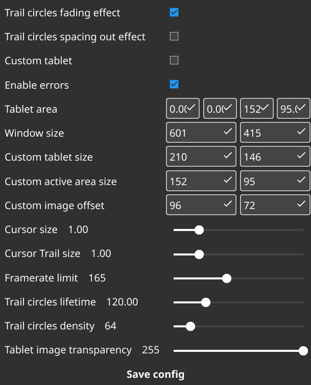

# Configurator for **Tablet Visualizer** (version >= 1.3.0)

A graphical configurator for **Tablet Visualizer**, built in Go and **Fyne** GUI framework. This tool allows users to easily modify the `Settings.json` file without manual editing.
#### Tablet Visualizer is a lightweight application designed to function as an overlay for OBS. It simulates a graphics tablet's surface and shows real-time input based on your mouse or tablet stylus movements. You can get it from here [Tablet-Visualizer](https://github.com/xO-3670/Tablet-Visualizer)

[](https://choosealicense.com/licenses/gpl-3.0/)
[](https://app.codacy.com/gh/xO-3670/Tablet-Visualizer-Configurator/dashboard?utm_source=gh&utm_medium=referral&utm_content=&utm_campaign=Badge_grade)
[](https://github.com/xO-3670/Tablet-Visualizer-Configurator/releases/tag/0.1.0)


# Installation
#### 1. Download the latest version from [Releases](https://github.com/xO-3670/Tablet-Visualizer-Configurator/releases).  
#### 2. Move executable to **Tablet Visualizer** folder (same directory as `Settings.json` file)

## Screenshots



## Build from Source
- Firstly download source
```sh
git clone https://github.com/xO-3670/Tablet-Visualizer-Configurator.git
```

- Secondly build
```sh
cd Tablet-Visualizer-Configurator
make
```
